# HanoClin

HanoClin is a website for a fictional animal clinic in Hanover made with html and CSS. Target audience are people with pets that are looking for a veterenarian in Hanover. Potential customers will find all information they need to contact the clinic and get an appointment as well as what services HanoClin provides.

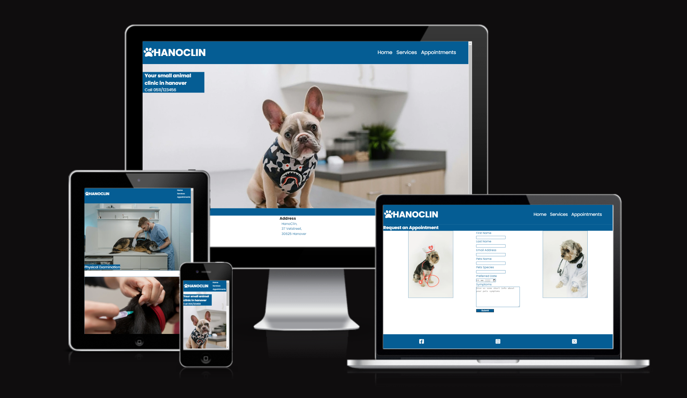

## Features

### Navigation bar
- The navigation bar is found on all pages of the website and has links to the landing page, the services page and the appointments page.
- This feature allows the user to reach all pages from all pages (with the exception of the feedback page) without the use of the back button.

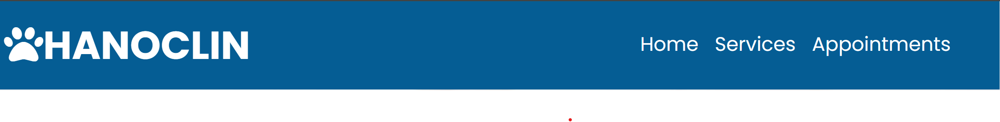

### The landing page
- The landing page instantly lets the user know what the website is about as well as what city the clinic is in via a photograph and text overlay.
- This page gives the user a phone number to call the clinic for possible questions or to make an appointment via phone call.
- On most screen sizes the contact section will already be visible on the bottom of the screen to show the user where to find more info about how to find the clinic.

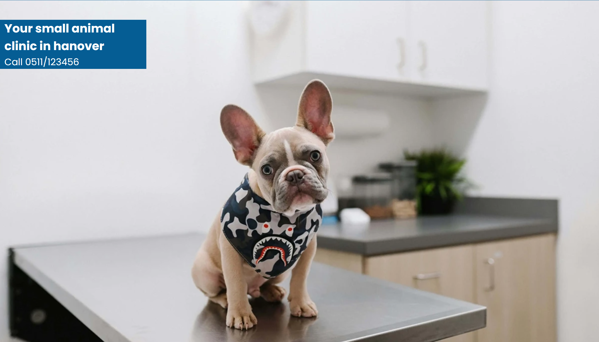

### Contact section
- The Contact section tells the user where to find the clinic with an adress and a google maps iframe that shows the exact location to make finding directions easy.
- This section has information on the opening hours of the clinic so the user knows when they can contact the clinic.

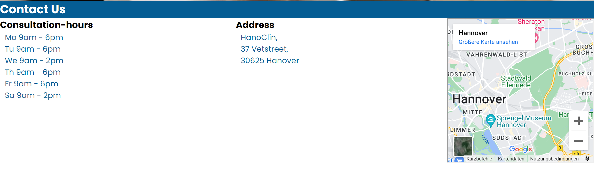

### Services section
- In the services section the user finds all the major services the clinic provides depicted by photographs with captions. This helps the user to decide wether HanoClin is the right clinic for their pet.

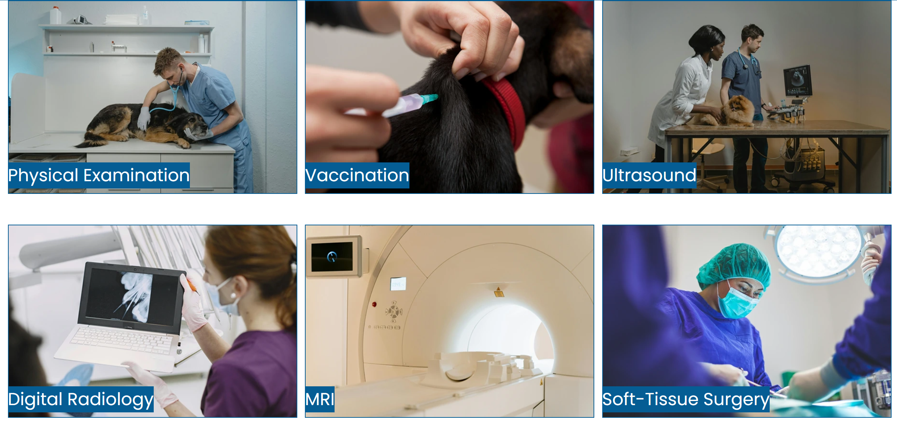

### Appointments section
- The appointments section has a form for the user to request an appointment at the clinic. This feature is useful for people who want to make an appointment at a time when the clinic staff is not available via phone.

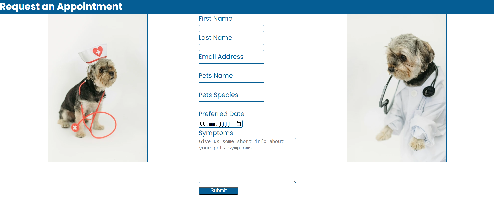

### Feedback page
- The feedback page informs those who fill out the appointments form that the clinic will reach out to them per email at a later point in time.

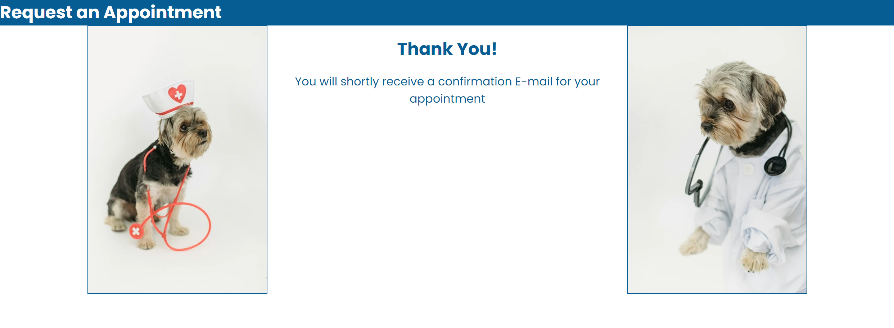

## Testing

### Manual Testing
- During testing, I used four different browsers to ensure cross-compatibility. The browsers used were:
    1. Firefox
    2. Chrome
    3. Edge
    4. Opera

- I used the devtools to simulate different screen sizes/devices from 320 px up to 2000px in width.

### Validators

***HTML***
1. **Section lacks heading:**
    - **Issue found:** Two Sections were found that had no heading. The first was in index.html with the id map. The second was in the services section with the id services-gallery
    - **Solution:** As I didn't want to add headings to these sections, I changed the id map section tag to a div tag and I deleted the second section all together and added the services-gallery id to the main tag of services.html instead.

2. **Stray end tag:**
    - **Issue found:** A stray end tag was found in all html files in the footer. 
    - **Solution:** I erased all the stray tags.

***CSS***
- No issues were found in the css file

    

### Lighthouse scores

#### Desktop:
I added only one screenshot for the desktop version as the scores were the same for all pages with only slight variations of 1-2 points in multiple tests.

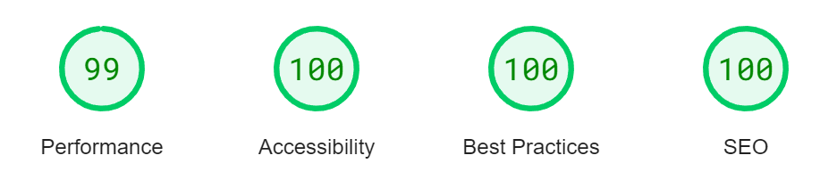

The best practices score started at 98 points as I forgot to add a title to the iframe element on index.html. After adding the title all best practices scores were 100.

#### Mobile:

Due to strong variations in the performance score. I added one screenshot for every page.
- index.html and services.html had the strongest variations in performance
    - index.html performance score varied between 80 and 88
    - services.html performance score varied between 60 and 93

##### index.html:
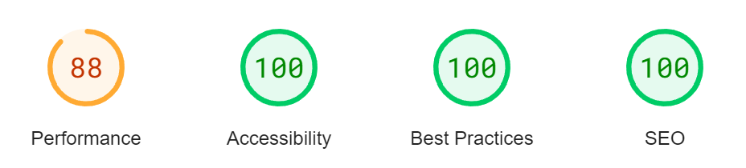

##### services.html:
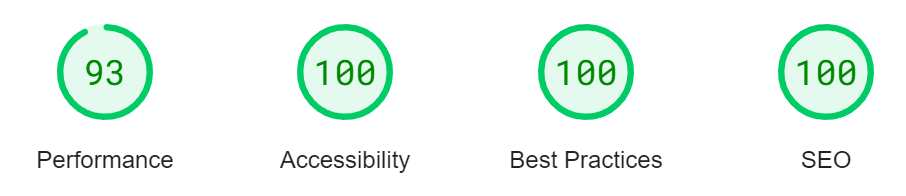

##### appointments.html
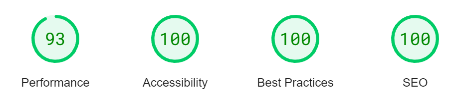

##### form-feedback.html
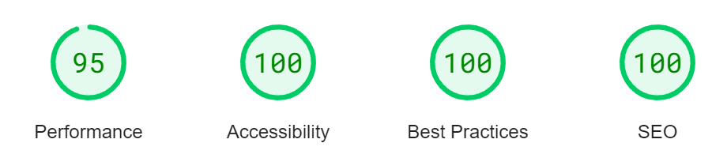

### WAVE
In addition I used the web accessibility evaluation tool (WAVE) and no errors were found.

## Deployment
The site was deployed to GitHub pages. The following steps were needed:
1. From the project's repository, go to the Settings tab.
2. On the left, go to the Pages tab.
3. Under Branch, choose main from the drop-down menu.
4. Click save and refresh the page
5. On the top of the pages tab, it shows successful deployment. 

## Credits

### General
- The project was influenced by the Code Institutes code along project called Love running. I tried to deviate from the code as much as possible. Nevertheless there may be similarities.
- I used W3schools, MDN web docs and the Code Inistitute HTML and CSS essentials content as general reference

### Content
- All text was written by myself.
- I referenced the YouTube tutorial [How to Center in CSS - EASY ( Center Div and Text Vertically and Horizontally )](https://www.youtube.com/watch?v=QdITQ4upjME) by [garnatti one](https://www.youtube.com/@garnattione) for instructions on how to center divs horizontally.

### Media

- The hero image was made by <a href="https://unsplash.com/de/@karsten116?utm_content=creditCopyText&utm_medium=referral&utm_source=unsplash">Karsten Winegeart</a> for <a href="https://unsplash.com/de/fotos/weiss-schwarzer-hund-mit-kurzem-mantel-in-weiss-schwarzem-polka-dot-shirt-loJL4ijUobg?utm_content=creditCopyText&utm_medium=referral&utm_source=unsplash">Unsplash</a>
- The picture for soft tissue surgery was made by <a href="https://unsplash.com/de/@arturtumasjan?utm_content=creditCopyText&utm_medium=referral&utm_source=unsplash">Artur Tumasjan</a> for <a href="https://unsplash.com/de/fotos/frau-tragt-grune-gesichtsmaske-qLzWvcQq-V8?utm_content=creditCopyText&utm_medium=referral&utm_source=unsplash">Unsplash</a>
- The pictures for [physical examination](https://www.pexels.com/de-de/foto/mann-hund-haustier-technologie-6235231/) and [ultrasound](https://www.pexels.com/de-de/foto/mann-frau-tier-hund-6235653/) were made by Tima Miroshnichenko for [pexels.com](https://www.pexels.com)
- The picture for the [MRI](https://www.pexels.com/de-de/foto/technologie-krankenhaus-medizin-medikament-7089024/) was made by MART  PRODUCTION for [pexels.com](https://www.pexels.com)
- The picture for [digital radiology](https://www.pexels.com/de-de/foto/laptop-zahne-zahnarzt-ergebnis-5622259/) was made by Gustavo Fring for [pexels.com](https://www.pexels.com)
- The picture for [vaccination](https://www.pexels.com/de-de/foto/haustier-pelzig-medikation-spritze-7155697/) was made by Önder Örtel for [pexels.com](https://www.pexels.com)
- The pictures of the [dog doctor](https://www.pexels.com/de-de/foto/kleiner-hund-im-hellen-studio-der-medizinische-uniform-tragt-5732464/) and the [dog nurse](https://www.pexels.com/de-de/foto/tier-hund-haustier-niedlich-5733423/) for the appointments section were made by Sam Lion for [pexels.com](https://www.pexels.com)
